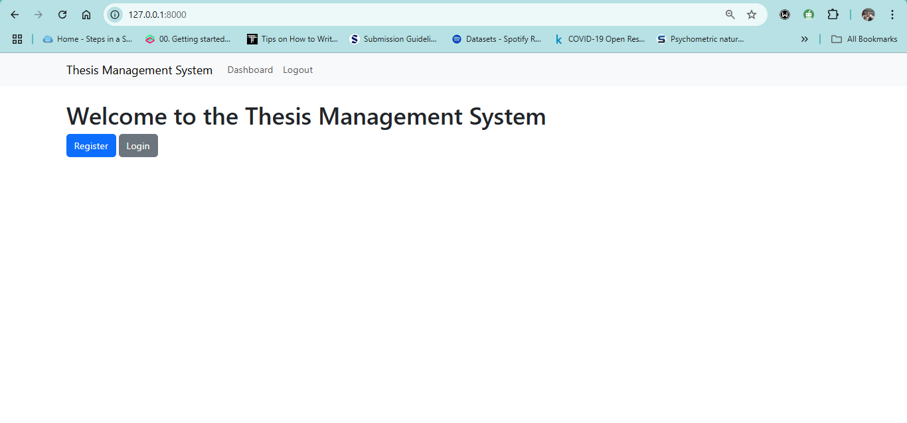
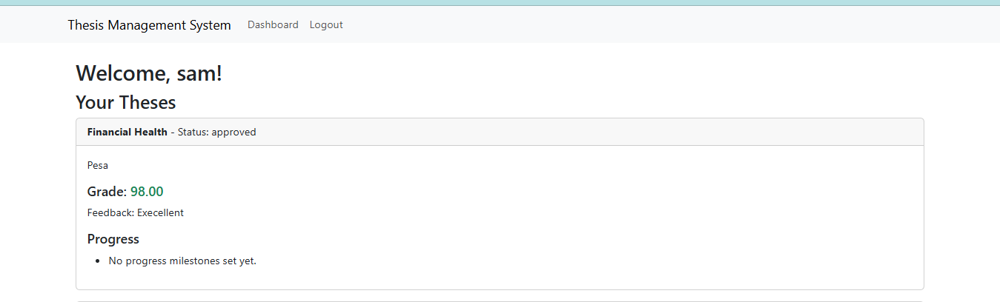
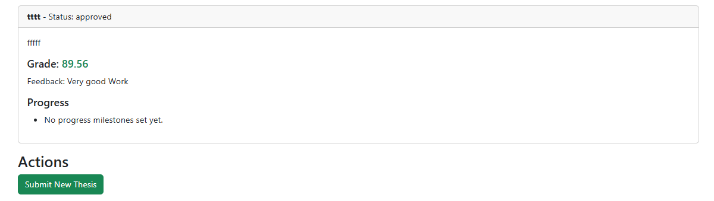
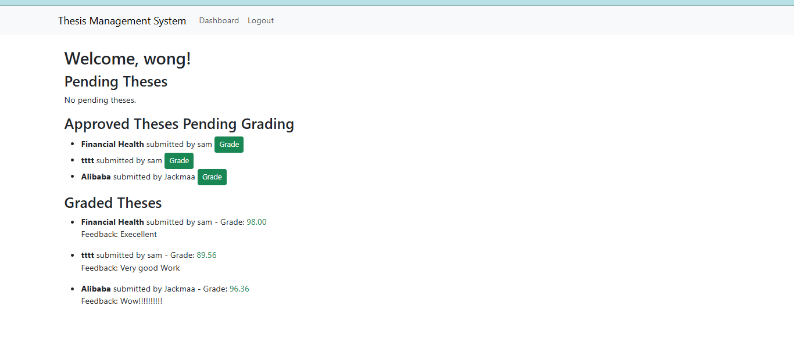

# Thesis-Management-System
The **Thesis Management System** is a web-based application designed to streamline the process of submitting, reviewing, and grading academic theses. It supports students, teachers, and administrators with role-specific dashboards and functionalities.

---

## Features

- **Student Features**:
  - Submit theses and assign them to teachers.
  - Track thesis progress and view grades/feedback.

- **Teacher Features**:
  - Review and grade theses.
  - Track the progress of assigned theses.

---

## System Overview

### Home Page

The home page provides easy navigation to register or log in based on the user type (student, teacher, or admin).



---

### Student Dashboard

The student dashboard allows students to:
- View their submitted theses and their statuses.
- Track progress and view grades/feedback.



---

### Submitting a Thesis

Students can submit a new thesis and assign it to a teacher from a dropdown list of available teachers.



---

### Teacher Dashboard

The teacher dashboard allows teachers to:
- View pending theses for review.
- Grade approved theses and provide feedback.
- Track theses assigned to them.



---

## How to Run the Project

1. Clone the repository:
   ```
   git clone https://github.com/sammainahkinya1404/Thesis-Management-System.git

2. Install dependencies:
   ``` 
    pip install -r requirements.txt
3. Run the server:
````
  python manage.py runserver
   
    http://127.0.0.1:8000.